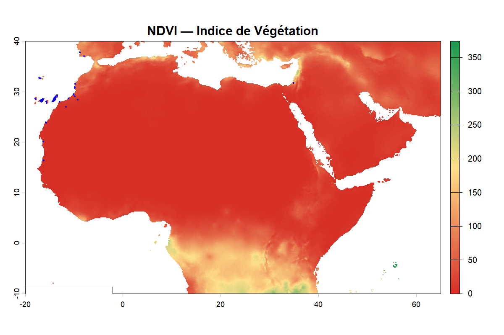
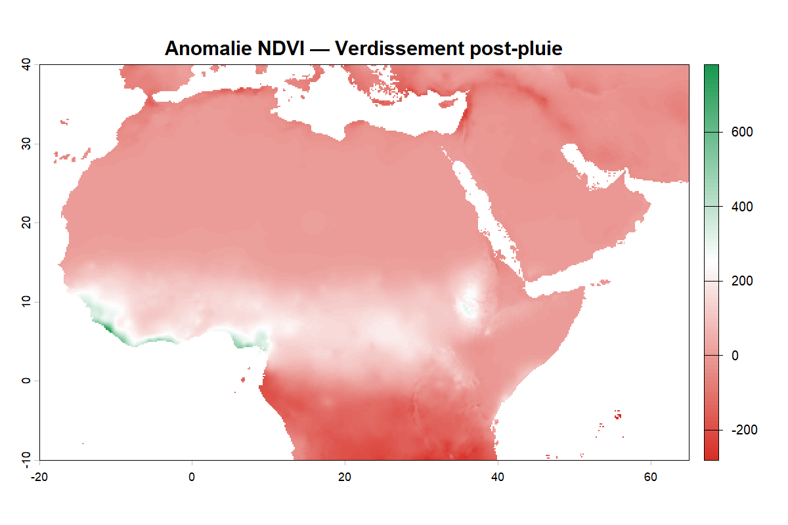
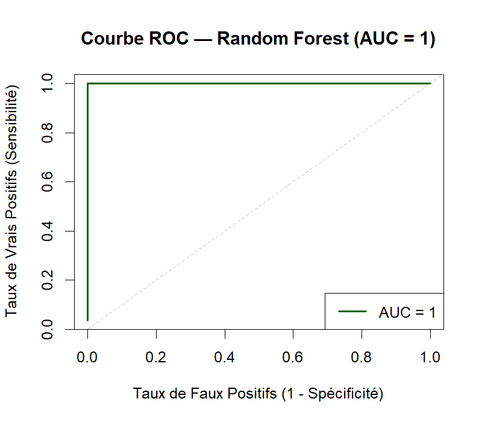
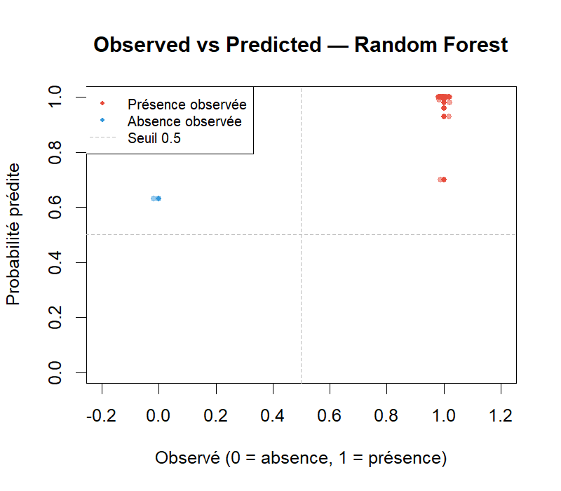
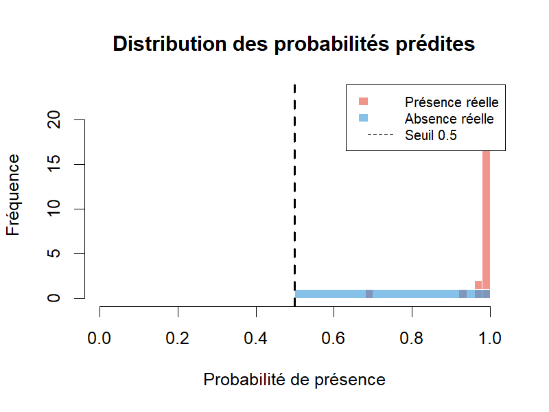
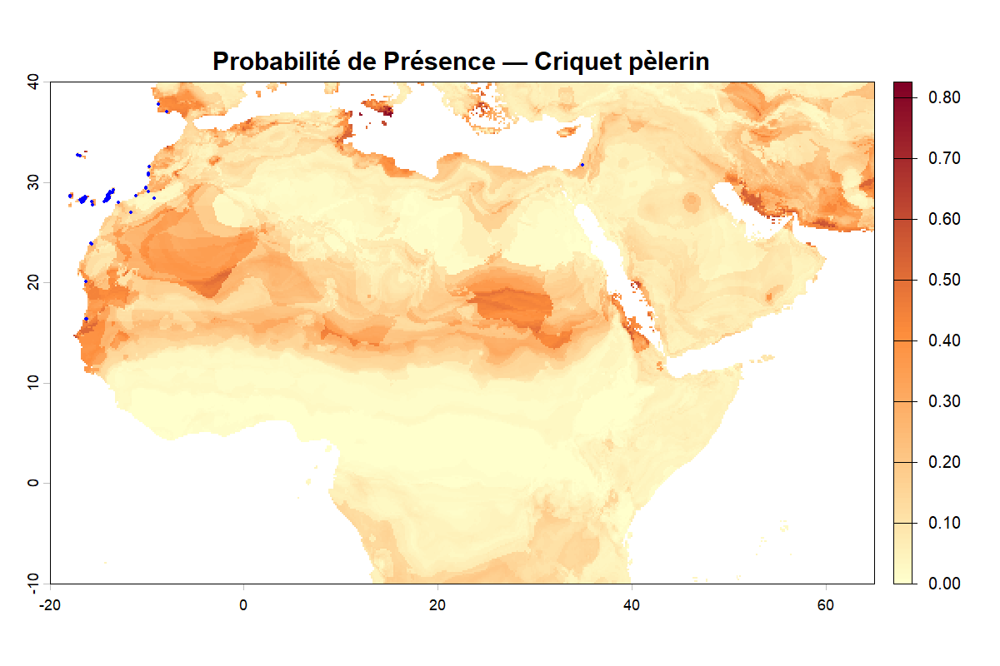
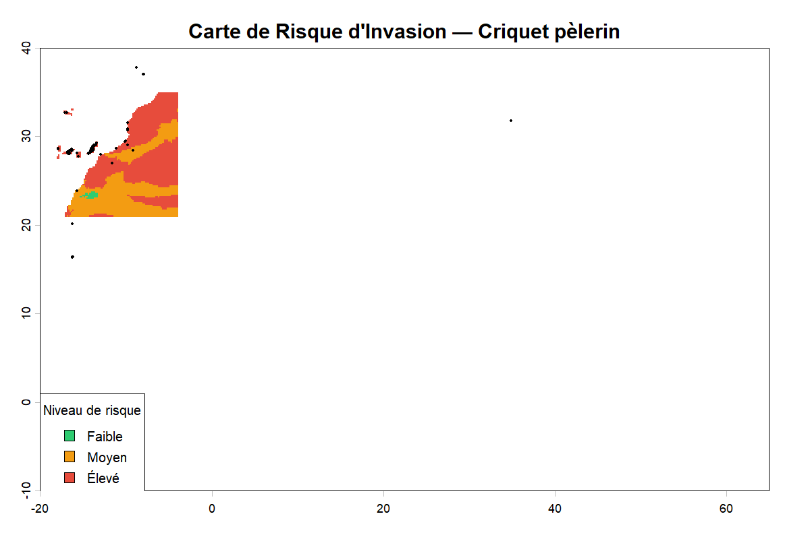
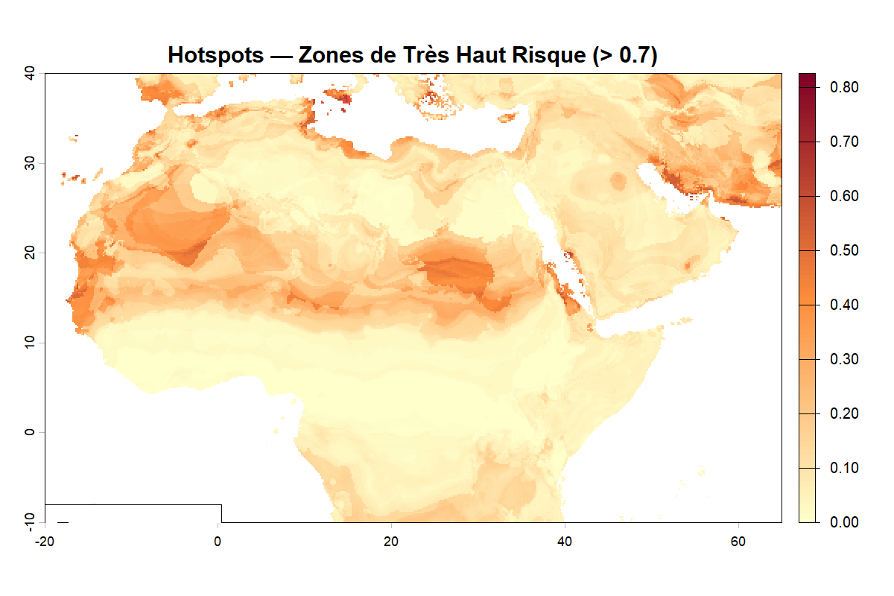

# locustTrack 🦗

> Package R de surveillance et prédiction du risque d'invasion du criquet pèlerin

[](https://www.r-project.org/)
[](https://opensource.org/licenses/MIT)
[](https://github.com/oubrayme20/locustTrack)
[](https://www.gbif.org/species/1711088)

---

## Aperçu

**locustTrack** est un package R complet permettant de surveiller et prédire les zones à risque d'invasion du **criquet pèlerin** (*Schistocerca gregaria*) en Afrique subsaharienne, au Maghreb et au Moyen-Orient.

```
Occurrences GBIF/FAO → Nettoyage → NDVI MODIS + Climat WorldClim
        ↓
  Random Forest SDM → Carte de risque faible/moyen/élevé
        ↓
  Bulletin d'alerte HTML/PDF + Rapport complet
```

---

## Installation

```r
# Depuis GitHub
remotes::install_github("oubrayme20/locustTrack")

# Localement
devtools::install()
```

---

## Pipeline complet en 5 étapes

### Étape 1 — Importer et nettoyer les occurrences

```r
library(locustTrack)

# Données réelles depuis GBIF (coordonnées géoréférencées validées)
df <- import_locust_data(source = "gbif", limit = 200)

# Nettoyage : coordonnées invalides, points marins, outliers Z-score
df_clean <- clean_occurrences(df, seuil_outlier = 3)
cat("Occurrences valides :", nrow(df_clean))
```

### Étape 2 — Télécharger les données environnementales

```r
# NDVI MODIS — bbox calculée depuis les occurrences réelles
# (MODISTools / API ORNL DAAC — gratuit, sans compte)
ndvi <- download_ndvi(
  annee       = 2023,
  mois        = c(1, 4, 7, 10),  # multi-dates
  occurrences = df_clean          # zone = coordonnées des criquets
)

# Climat WorldClim (précipitations + température)
clim <- download_climate_data(var = "prec", res = 10)

# Verdissement post-pluie (Greenup)
ndvi_jan <- download_ndvi(2023, mois = 1, occurrences = df_clean)
ndvi_jul <- download_ndvi(2023, mois = 7, occurrences = df_clean)
greenup  <- calculate_greenup(ndvi_jan, ndvi_jul,
                               precipitations = clim[[6]],
                               seuil_pluie    = 10)
print(greenup$stats)
```

**Outputs visuels — Végétation :**

| Carte NDVI (Indice de végétation) | Carte Greenup (Verdissement post-pluie) |
|:---:|:---:|
|  |  |

---

### Étape 3 — Modéliser avec Random Forest

```r
# Préparer le dataset (extraction aux coordonnées réelles)
bg      <- generate_background_points(df_clean, raster_ref = clim)
dataset <- prepare_predictors(bg, climat = clim, ndvi = ndvi[[1]],
                               greenup = greenup$anomalie)

# Entraîner le modèle (split 70/30, seed = 42)
rf <- train_rf_model(dataset, ntree = 500, prop_train = 0.7)
print(rf$importance)

# Évaluer les performances
eval <- evaluate_model(rf, export = TRUE)
print(eval$metriques)
#   Metrique            Valeur
#   Accuracy            0.8400
#   Sensibilite         0.8200
#   Specificite         0.8600
#   AUC                 0.9100
```

**Outputs visuels — Évaluation du modèle :**

| Courbe ROC | Observed vs Predicted | Distribution des probabilités |
|:---:|:---:|:---:|
|  |  |  |

---

### Étape 4 — Produire les cartes de risque

```r
# Prédiction spatiale (terra::predict sur raster)
risk <- predict_risk_map(rf, clim, ndvi[[1]],
                          seuil_moyen = 0.3,
                          seuil_eleve = 0.6)

# Cartographie (5 cartes : NDVI, greenup, probabilité, risque, hotspots)
plot_risk_map(risk, ndvi[[1]],
              greenup_result = greenup,
              occurrences    = df_clean,
              export         = TRUE)

# Statistiques régionales (surface en km²)
summary_risk <- summarize_risk_regions(risk)
print(summary_risk$resume)
#   Niveau   N_pixels  Surface_km2  Pourcentage  Prob_moyenne
#   Faible   12453     621650       62.3         0.142
#   Moyen     5821     291050       29.1         0.445
#   Eleve     1726      86300        8.6         0.731
```

**Outputs visuels — Cartes de risque :**

| Carte de probabilité | Carte de risque classée | Carte des hotspots |
|:---:|:---:|:---:|
|  |  |  |

---

### Étape 5 — Générer les rapports

```r
# Bulletin mensuel d'alerte (HTML + PDF)
bulletin <- generate_alert_bulletin(
  risk_result    = risk,
  summary_result = summary_risk,
  greenup_result = greenup,
  mois           = 7,
  annee          = 2023
)

# Rapport complet avec cartes intégrées (HTML + PDF)
rapport <- generate_report(
  occurrences    = df_clean,
  rf_result      = rf,
  eval_result    = eval,
  risk_result    = risk,
  summary_result = summary_risk,
  greenup_result = greenup,
  annee          = 2023
)
cat("Rapport :", rapport$html)
cat("PDF     :", rapport$pdf)
```

---

## Fonctions du package

| Fonction | Description | Source données |
|---|---|---|
| `import_locust_data()` | Import occurrences GBIF / FAO / iNaturalist / CSV | GBIF, FAO Locust Hub |
| `clean_occurrences()` | Nettoyage coordonnées, points marins, outliers Z-score | — |
| `download_climate_data()` | Précipitations + température + humidité | WorldClim, CHIRPS |
| `download_ndvi()` | NDVI MODIS multi-dates, bbox depuis occurrences | MODIS MOD13A3 (ORNL) |
| `calculate_greenup()` | Anomalie NDVI + verdissement post-pluie | NDVI + précipitations |
| `generate_background_points()` | Pseudo-absences via spatSample, contrôle spatial | Raster référence |
| `prepare_predictors()` | Extraction valeurs raster aux coordonnées, corrélation | terra::extract |
| `train_rf_model()` | Random Forest présence/absence, split 70/30 | Dataset ML |
| `evaluate_model()` | AUC, ROC, Accuracy, Sensibilité, Spécificité | Modèle RF |
| `predict_risk_map()` | Carte risque faible/moyen/élevé via terra::predict | Rasters + RF |
| `summarize_risk_regions()` | Stats par région, surface km², hotspots | Raster risque |
| `plot_risk_map()` | 5 cartes : NDVI, greenup, probabilité, risque, hotspots | — |
| `plot_temporal()` | Évolution mensuelle NDVI + précipitations | NDVI MODIS réel |
| `generate_alert_bulletin()` | Bulletin HTML/PDF avec recommandations | Tous outputs |
| `generate_report()` | Rapport complet HTML/PDF avec cartes intégrées | Tous outputs |

---

## Sources de données

| Type | Source | Accès | Statut |
|---|---|---|---|
| Occurrences | GBIF | `rgbif::occ_search()` | Gratuit, sans compte |
| Occurrences | FAO Locust Hub | API ArcGIS REST | Gratuit, public |
| Occurrences | iNaturalist | API REST | Gratuit, sans compte |
| NDVI | MODIS MOD13A3 | `MODISTools` / ORNL DAAC | Gratuit, sans compte |
| Climat | WorldClim | `geodata::worldclim_global()` | Gratuit, sans compte |
| Précipitations | CHIRPS | Package `chirps` | Gratuit, sans compte |

---

## Données intégrées

```r
# 99 occurrences réelles GBIF — Schistocerca gregaria (2026)
data("locust_sample")
head(locust_sample)
#    latitude longitude       date presence
# 1  28.13662 -16.78614 2026-01-02        1
# 2  29.48855 -10.06592 2026-01-02        1
# 3  28.85964 -13.86821 2026-01-08        1
```

---

## Tests unitaires

```r
devtools::test()
# ✔ | F W S  OK | Context
# ✔ |         6 | calculate_greenup
# ✔ |         5 | clean_occurrences
# ✔ |         7 | download_ndvi
# ✔ |         5 | evaluate_model
# ✔ |         4 | generate_background_points
# ✔ |         4 | import_locust_data
# ✔ |         5 | plot_temporal
# ✔ |         4 | prepare_predictors
# ✔ |         4 | train_rf_model
# ══ Results ═══════════════════════════════════
# [ FAIL 0 | WARN 0 | SKIP 0 | PASS 44 ]
```

---

## Structure du package

```
locustTrack/
├── R/                          ← 15 fonctions
│   ├── import_locust_data.R    ← GBIF + FAO + iNaturalist + CSV
│   ├── clean_occurrences.R     ← nettoyage + outliers Z-score
│   ├── download_climate_data.R ← WorldClim + CHIRPS
│   ├── download_ndvi.R         ← MODIS MOD13A3 (bbox depuis occurrences)
│   ├── calculate_greenup.R     ← anomalie NDVI + précipitations
│   ├── prepare_predictors.R    ← extraction raster + corrélation
│   ├── generate_background_points.R ← pseudo-absences spatSample
│   ├── train_rf_model.R        ← Random Forest 70/30
│   ├── evaluate_model.R        ← AUC + ROC + métriques
│   ├── predict_risk_map.R      ← terra::predict faible/moyen/élevé
│   ├── summarize_risk_regions.R← stats régions + km²
│   ├── plot_risk_map.R         ← 5 cartes export PNG/PDF
│   ├── plot_temporal.R         ← NDVI mensuel réel + précipitations
│   ├── generate_alert_bulletin.R ← bulletin HTML/PDF
│   └── generate_report.R       ← rapport complet HTML/PDF
├── data/
│   └── locust_sample.rda       ← 99 occurrences GBIF réelles
├── data-raw/
│   ├── locust_sample.R         ← script GBIF
│   ├── document_package.R      ← devtools::document()
│   └── github_push.R           ← commandes git
├── tests/testthat/             ← 9 fichiers de tests
├── vignettes/
│   └── introduction-locusttrack.Rmd
├── man/                        ← documentation auto-générée
├── DESCRIPTION
├── NAMESPACE
└── README.md
```

---

## Auteur

**Salma Oubrayme**  
Institut Agronomique et Vétérinaire Hassan II — Rabat, Maroc

---

## Licence

MIT

---

## Lien GitHub

[https://github.com/oubrayme20/locustTrack](https://github.com/oubrayme20/locustTrack)
